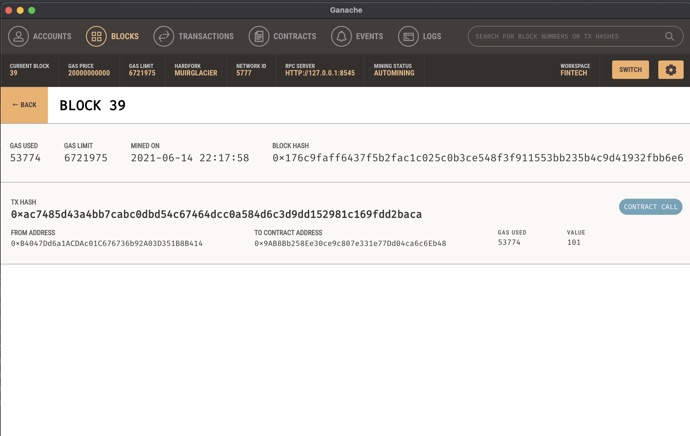
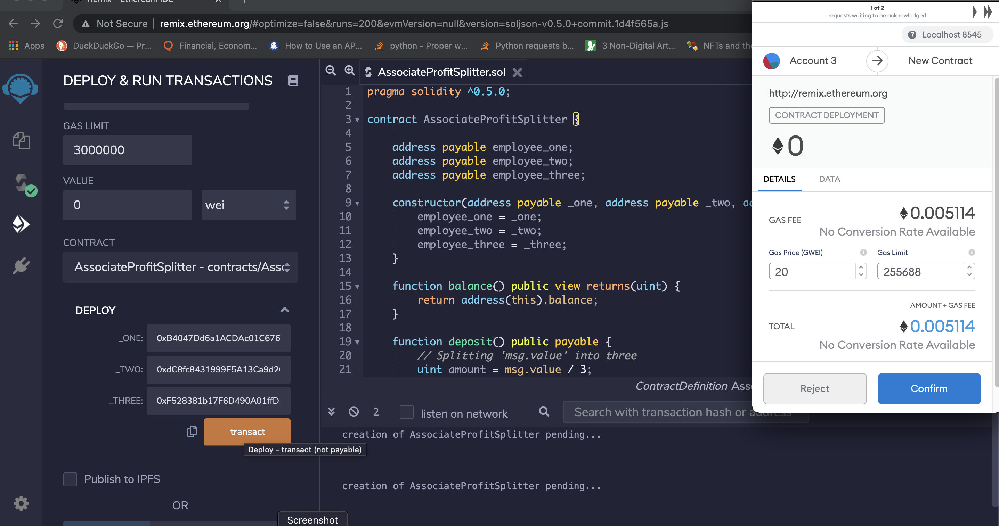
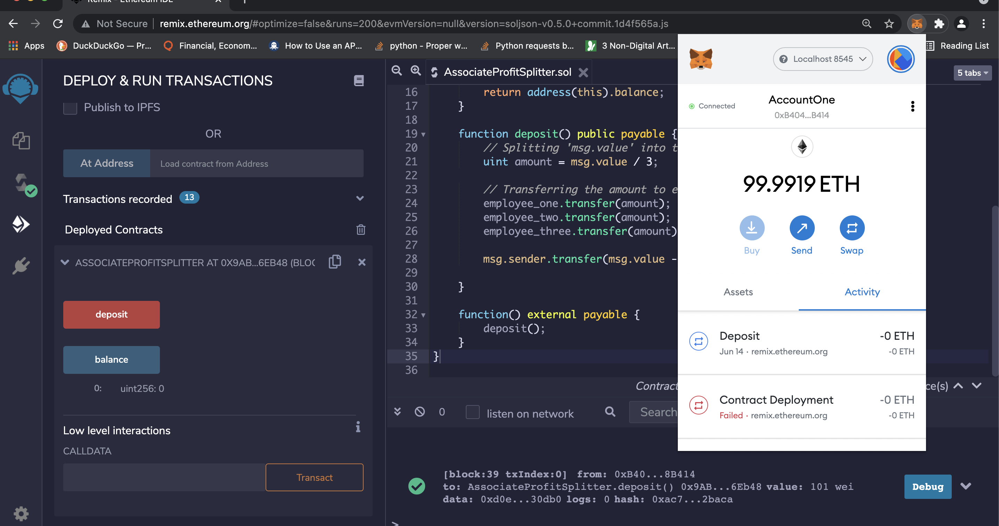
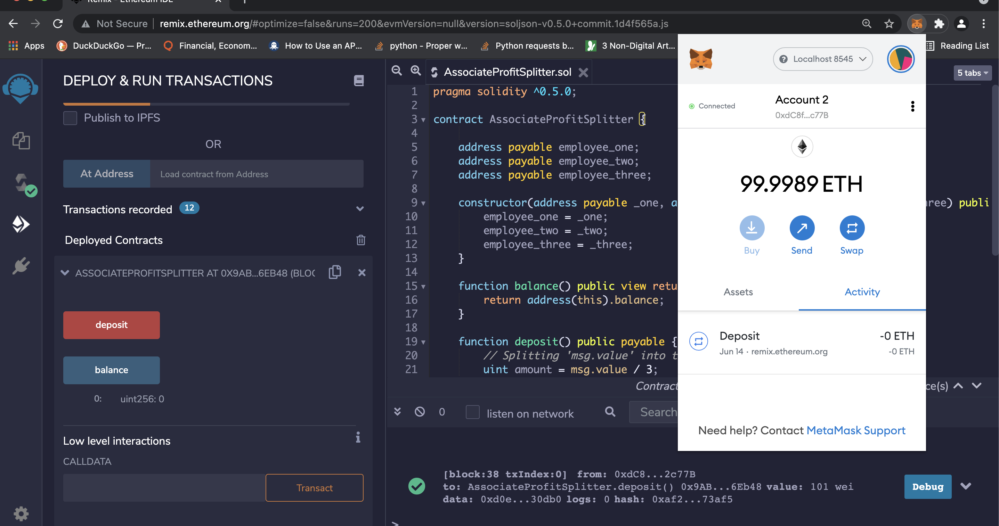
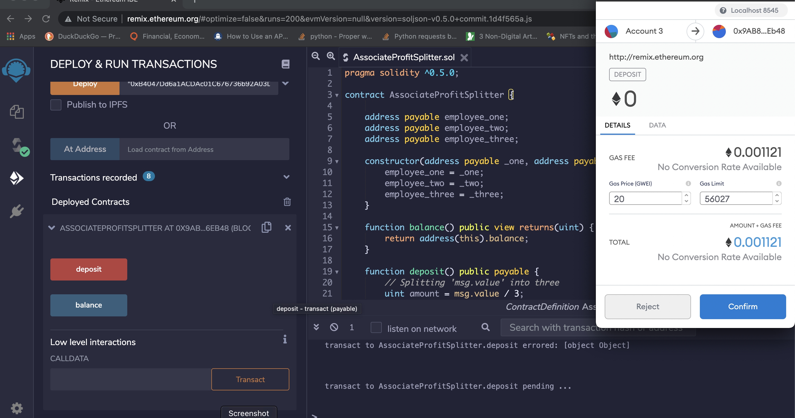

# ProfitSplitter-Solidity

In this project I created a smart contract designed to run on an Ethereum-compatible blockchain to facilitate the auditing, accounting, and overall finances of a company. 

The smart contract is an `AssociateProfitSplitter` contract. This will accept Ether into the contract and divide the Ether evenly among the associate level employees. This will allow the Human Resources department to pay employees quickly and efficiently.

To kick-off the development, I utilized [Remix IDE](https://remix.ethereum.org) and created a new contract called `AssociateProfitSplitter.sol`

To develop and test the contract, I used the [Ganache](https://www.trufflesuite.com/ganache) development chain, and pointed MetaMask to `localhost:8545`.

### The `AssociateProfitSplitter` Contract

#### Testing the contract

Tested the `deposit` function by sending various small values.

